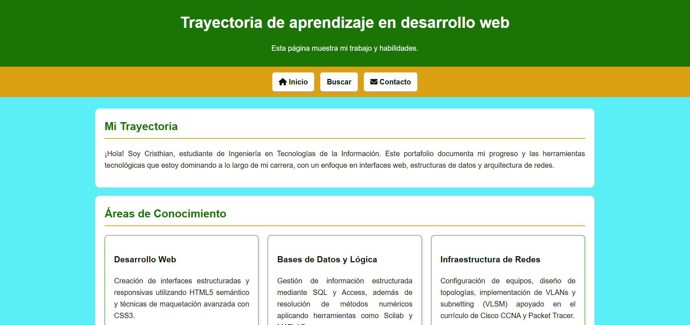

# Práctica Final CSS: Portafolio Responsivo 🌐

## Descripción del Proyecto
Este proyecto es el resultado de la práctica final de la Unidad 2. Consiste en la construcción de un sitio web aplicando etiquetas semánticas de HTML5 y maquetación avanzada con CSS3. El sitio incluye un formulario interactivo y una página de portafolio personal adaptada a dispositivos móviles utilizando Flexbox y Media Queries, respetando el enfoque Mobile-First.

## Estructura de Carpetas 📁
El proyecto está organizado de la siguiente manera:

* `audio/` - Archivos de sonido de prueba.
* `css/` - Hojas de estilo generales y específicas (portafolio.css, buscar.css).
* `img/` - Imágenes utilizadas en el sitio y capturas para documentación.
* `video/` - Archivos de video locales.
* `index.html` - Página principal.
* `buscar.html` - Formulario de búsqueda (método GET).
* `contacto.html` - Formulario de contacto.
* `portafolio.html` - Página de trayectoria de aprendizaje.

## Capturas de Pantalla 📸

## Tecnologías Utilizadas 💻
* HTML5 (Semántica y atributos de formularios)
* CSS3 (Modelo de Caja, Flexbox, Media Queries)
* Git y GitHub (Control de versiones)

## Información del Autor 👨‍💻
* **Autor:** Cristhian Ruiz
* **Carrera:** Ingeniería en Tecnologías de la Información
* **Institución:** Universidad de las Fuerzas Armadas (ESPE)